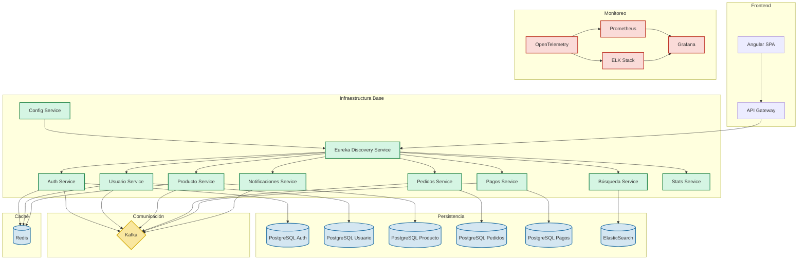

```mermaid
%%{ init: { "theme": "default", "flowchart": { "useMaxWidth": true } } }%%
graph TD
    subgraph "Infraestructura Base"
        CS[Config Service] --> EDS[Eureka Discovery Service]
        EDS --> AUTH[Auth Service]
        EDS --> USR[Usuario Service]
        EDS --> PROD[Producto Service]
        EDS --> PED[Pedidos Service]
        EDS --> PAG[Pagos Service]
        EDS --> NOT[Notificaciones Service]
        EDS --> BUS[Búsqueda Service]
        EDS --> STATS[Stats Service]
    end

    subgraph "Frontend"
        ANG[Angular SPA] --> APIG[API Gateway]
        APIG --> EDS
    end

    subgraph "Persistencia"
        AUTH --> DB_AUTH[(PostgreSQL Auth)]
        USR --> DB_USR[(PostgreSQL Usuario)]
        PROD --> DB_PROD[(PostgreSQL Producto)]
        PED --> DB_PED[(PostgreSQL Pedidos)]
        PAG --> DB_PAG[(PostgreSQL Pagos)]
        BUS --> ES[(ElasticSearch)]
    end

    subgraph "Comunicación"
        AUTH --> KAFKA{Kafka}
        USR --> KAFKA
        PROD --> KAFKA
        PED --> KAFKA
        PAG --> KAFKA
        NOT --> KAFKA
    end

    subgraph "Caché"
        AUTH --> REDIS[(Redis)]
        USR --> REDIS
        PROD --> REDIS
    end

    subgraph "Monitoreo"
        PROM[Prometheus] --> GRAF[Grafana]
        ELK[ELK Stack] --> GRAF
        OTEL[OpenTelemetry] --> PROM
        OTEL --> ELK
    end

    classDef microservice fill:#d5f5e3,stroke:#1e8449,stroke-width:2px;
    classDef database fill:#d4e6f1,stroke:#2874a6,stroke-width:2px;
    classDef monitoring fill:#fadbd8,stroke:#c0392b,stroke-width:2px;
    classDef messaging fill:#f9e79f,stroke:#d4ac0d,stroke-width:2px;

    class CS,EDS,AUTH,USR,PROD,PED,PAG,NOT,BUS,STATS microservice;
    class DB_AUTH,DB_USR,DB_PROD,DB_PED,DB_PAG,ES,REDIS database;
    class PROM,GRAF,ELK,OTEL monitoring;
    class KAFKA messaging;
```
